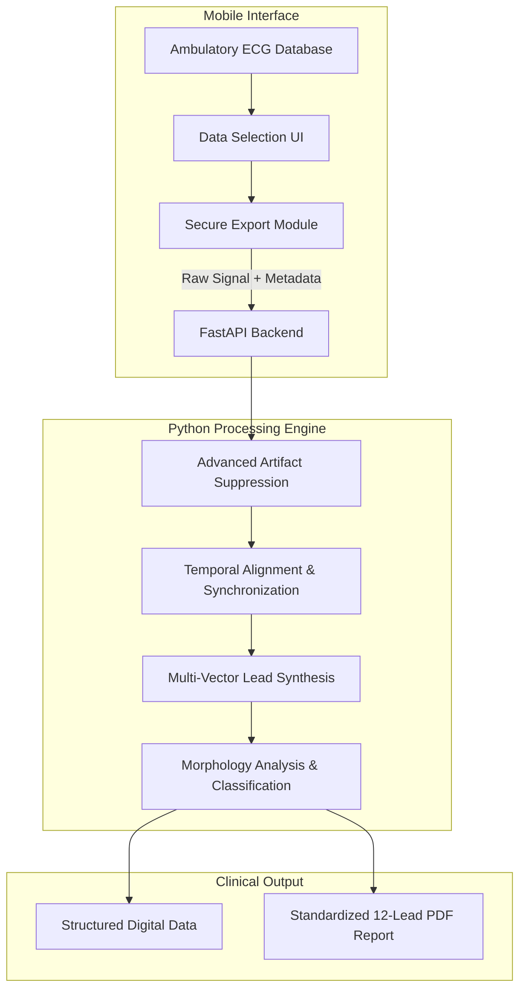

# 12-Lead ECG Digital Fusion Synthesizer

> **⚠️ Medical & Regulatory Disclaimer**

For Technical Demonstration and Research Purposes Only.

Clinical Limitations & Off-Label Use: Standard consumer wearables (e.g., Apple Watch) are clinically validated and FDA-cleared only for Lead I rhythm strips. Any attempt to obtain other leads using such hardware is strictly off-label, unverified, and lacks clinical validation.

Experimental Synthesis: The 12-lead reconstructions shown in this project are the result of mathematical synthesis and digital signal processing experiments. They have not been tested for diagnostic accuracy, sensitivity, or specificity.

Not for Diagnostic Use: This software is a hobby project and is not a medical device. It must not be used to diagnose, treat, or manage any medical condition.

No Professional Liability: As the developer, I (Denis Fedorov) provide this as a proof-of-concept only. All clinical decisions should be made using standard-of-care, 12-lead hospital ECG equipment.

**A Python and FastAPI-based pipeline for synthesizing, synchronizing, and visualizing 12-lead electrocardiograms from mobile health hardware.**

As an Electrophysiologist, I often encounter the limitations of consumer mobile ECG devices. While they excel at single-lead ambulatory monitoring, they lack the multi-vector spatial resolution necessary for comprehensive arrhythmia and ischemia analysis. This project represents an innovative approach to overcome these limitations. By leveraging sequential recording and advanced digital signal processing, this pipeline reconstructs a standard 12-lead ECG from mobile hardware.

## System Architecture

## How It Works

### 1. Data Ingestion
The native mobile application serves as the frontend. Users can browse their device's health database, select specific ECG recordings, and securely export the raw voltage data. The app packages the raw samples and essential metadata, transmitting it seamlessly to the FastAPI backend.

### 2. Clinical-Grade Signal Processing
Once the Python engine receives the raw data, it is routed through a signal processing pipeline:
- **Artifact Suppression**: Identifies and removes sudden motion artifacts and electrical interference without destructively filtering the high-frequency amplitude of the native QRS complexes.
- **Hardware Lock & Synchronization**: When aligning independently recorded leads, the system utilizes advanced temporal alignment techniques to correct for minute hardware clock drifts and ensure perfect physiological synchronization.
- **Lead Synthesis**: Mathematically derives unrecorded limb leads utilizing the synchronized and denoised data streams, creating a complete spatial representation of the heart's electrical activity.
- **Morphology Analysis**: Implements pattern recognition algorithms to classify individual heartbeats and perform comprehensive wave delineation (P, Q, S, T) against dynamically generated templates.

## Key Features & Clinical Utility
- **Diagnostic-Grade Reconstructions**: Overcomes the physical limitations of mobile devices by calculating true multi-vector representations.
- **Precision Synchronization**: Ensures that temporal measurements (PR, QRS, QT/QTc intervals) remain clinically accurate despite originating from hardware with disparate or drifting sampling rates.
- **Standardized Visualizations**: Automatically renders the processed data into a traditional, universally recognized 12-lead ECG grid format (25 mm/s, 10 mm/mV), making it immediately readable by any cardiologist.

---
*This README.md file was generated using a LLM*
*A video tutorial will be added soon*
